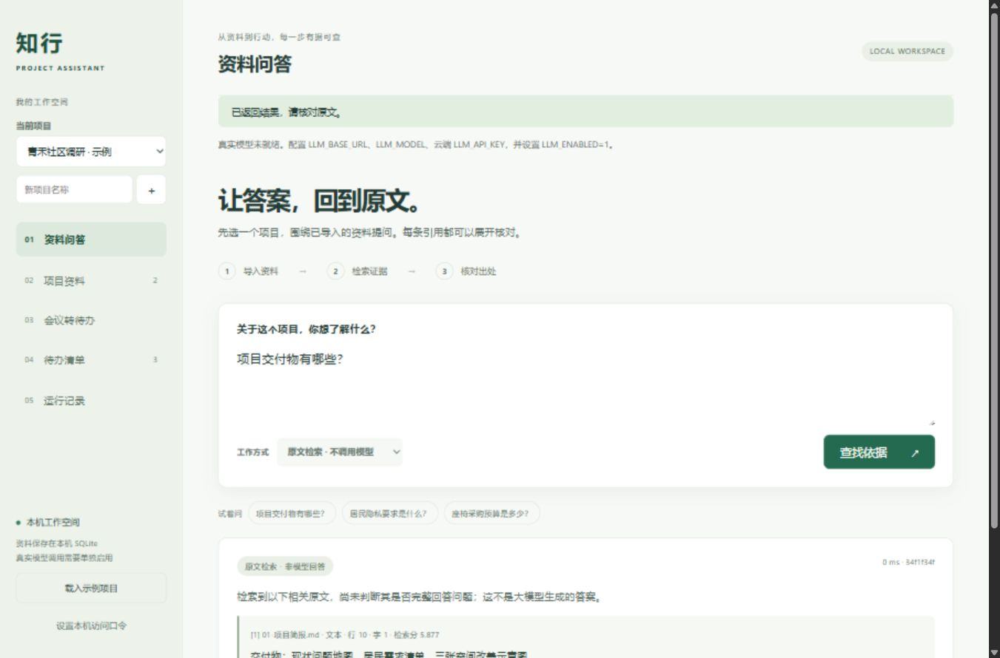

# 知行 · 项目资料问答与待办助手

把项目简报、方案说明和会议记录变成可核对的资料依据，以及必须人工确认的待办。

这是一个 **FastAPI + SQLite + 原生 HTML/CSS/JavaScript** 的本机应用。浏览器页面连接真实后端，资料、草稿、待办和运行记录持久化保存。无需 Docker、Node 构建步骤或向量数据库。

**当前验证状态：**21 项功能测试通过；30 题原文检索基线及真实 Codex 模型评测已完成，会议提取与浏览器真实问答已验证。2026-09-12 已推送到 [GitHub 私有仓库](https://github.com/penpenguin1412/project-knowledge-assistant)。此仓库不以离线检索、规则提取或测试替身冒充大模型结果；源码上传不代表应用已在线部署。



## 快速运行

需要 Python 3.11+。首次安装依赖需要网络。

Windows PowerShell，在仓库目录执行：

```powershell
.\start.ps1
```

若本机策略不允许执行脚本，逐行执行下列命令；无需修改系统执行策略：

```powershell
python -m venv .venv
.\.venv\Scripts\python.exe -m pip install -r requirements.txt
.\.venv\Scripts\python.exe -m uvicorn app:app --host 127.0.0.1 --port 8765 --no-proxy-headers
```

macOS / Linux：

```bash
python3 -m venv .venv
.venv/bin/python -m pip install -r requirements.txt
.venv/bin/python -m uvicorn app:app --host 127.0.0.1 --port 8765 --no-proxy-headers
```

打开 <http://127.0.0.1:8765>，点击「载入示例项目」。停止服务：终端按 `Ctrl+C`。端口占用时将 `--port` 换成空闲端口，并使用相应地址。

## 可以做什么

|流程|行为与边界|
|---|---|
|项目资料|创建项目；导入 UTF-8 TXT、MD、文字 PDF、DOCX；查看原文；归档与恢复|
|原文检索|中文双字词与英文词的 BM25 检索；返回前 5 个片段、文件名与位置；不生成自然语言答案|
|真实模型问答|发送问题和检索到的片段给配置的模型；要求逐项引用；资料不足要求拒答；无引用或伪造引用的输出被拒绝展示|
|会议转待办|规则模式只读取明确格式；模型模式支持自然语言会议记录；负责人/日期缺失时保持待定|
|人工确认|提取只落草稿表；勾选事项并确认后，事务写入待办表；重复或并发确认不会重复创建|
|待办管理|修改标题、负责人、截止日期及状态；待开始/进行中/已完成/已取消筛选；显示逾期|
|运行记录|保存输入、引用快照、模型标识、返回 usage、耗时和失败状态；页面显示最近 100 次，支持 JSON 导出|

规则提取格式：

```text
待办：完成问题地图 | 负责人：许宁 | 截止：2026-09-18
待办：确认评审场地 | 负责人：待定 | 截止：待定
```

日期应为 `YYYY-MM-DD`。自由文本和相对日期不由规则模式猜测；原文保留供人工判断。未明确的字段可在确认时补充。

## 配置真实模型

默认 **不调用任何模型，不需要 API 密钥**。本机已登录官方 Codex CLI 时，执行 `.\start-codex.ps1` 即可使用 `gpt-6-astra`，调用会使用登录账号的 Codex 额度。无需下载本地模型或提取登录凭据。设置与限制见 [Codex 接入说明](docs/CODEX.md)。

也可使用兼容 `/v1/chat/completions` 的接口，模型须支持 `response_format: {"type":"json_object"}`、`temperature` 与 `max_tokens`。不是所有提供商都兼容；不兼容时明确报错，不会静默切换模型。

配置仅从服务进程的环境变量读取。`.env.example` 是说明文件，**不会自动加载 `.env`**。修改环境变量后重启服务。

|变量|说明|
|---|---|
|`LLM_ENABLED`|只有值为 `1` 才允许调用；启用后，选择模型模式并提交即表示同意发送该次资料及可能产生的费用|
|`LLM_PROVIDER`|默认 `openai_compatible`；设为 `codex` 时通过本机官方 CLI 调用|
|`CODEX_BIN`|可选官方 Codex 可执行文件路径；未设置时从 PATH 查找|
|`LLM_BASE_URL`|提供商基础 URL，通常以 `/v1` 结尾；云端必须 HTTPS，禁止凭据嵌入 URL、重定向、查询串|
|`LLM_MODEL`|该提供商支持的模型标识；请自行确认 JSON 模式兼容性|
|`LLM_API_KEY`|云端接口密钥，只留在本机进程；无需发送给项目作者或提交仓库|
|`ASSISTANT_TOKEN`|可选本机访问口令，界面「设置本机访问口令」输入；不是模型密钥|
|`ASSISTANT_DB`|可选数据库路径，默认仓库 `data/assistant.db`；数据库及运行记录可能包含隐私|

本地 Ollama 已安装模型时，可使用如下配置。模型名换成本机实际安装项；这不是下载或调用授权，也不自动安装模型。

```powershell
$env:LLM_BASE_URL = 'http://127.0.0.1:11434/v1'
$env:LLM_MODEL = '你的本机模型名'
$env:LLM_ENABLED = '1'
.\.venv\Scripts\python.exe -m uvicorn app:app --host 127.0.0.1 --port 8765 --no-proxy-headers
```

云端配置同理，使用提供商 HTTPS 地址与密钥。密钥请通过你自己的本机环境管理方式输入，避免明文终端历史。不要放在 URL、截图、前端源码或 GitHub Issues。参考 [Ollama 官方兼容性文档](https://docs.ollama.com/api/openai-compatibility)。

应用不自动重试模型请求。兼容 HTTP 接口单次输出预算为 1800 tokens，网络连接和每次读取超时均为 45 秒；Codex CLI 单次进程超时为 55 秒，同一应用进程仅允许一条 Codex 请求运行。前端等待 65 秒后提示超时；超时并不能证明提供商没有扣费或消耗额度，先查运行记录再决定是否重试。问答只提交前 5 个片段和问题；会议提取提交用户输入的会议全文。Codex 还附带其自身的系统上下文。状态中的“已配置”只表示配置完整，不代表连接测试通过。

## 测试与评测

```powershell
.\.venv\Scripts\python.exe tests.py
.\.venv\Scripts\python.exe evaluate.py
```

测试使用 `unittest` 和 FastAPI TestClient；不访问外部模型。测试及评测建立各自的 `data/test-*.db`、`data/evaluation-*.db`，不覆盖用户数据库，也不自动批量删除文件。测试替身仅用于验证错误处理和引用校验，不计入真实模型表现。

30 题覆盖事实、人员、日期、范围、缺资料、错误前提、指令注入和越权问题。自编示例资料的 SHA-256、每题真实返回、候选片段、引用与耗时保存在 [reports/baseline.json](reports/baseline.json)，可读汇总见 [reports/baseline.md](reports/baseline.md)。

已取得的基线：30/30 HTTP 成功；18/18 可回答题命中预设原文；12 道不可回答题中，5 道无检索结果、7 道仍返回相关片段。**这不是 100% 问答正确率，也不是模型拒答率。** 测试集规模小、来源单一且未做独立留出测试，不外推到真实业务成效。

真实模型评测在本机配置好模型、确认资料可发送并接受费用后手动执行，最多 30 次调用：

```powershell
.\.venv\Scripts\python.exe evaluate.py --live --allow-model-calls
```

会生成带时间戳的 `reports/live-*.json` 与 `.md`。逐字引用检查只能验证出处存在，不能证明引用支持回答；每题保留 `human_semantic_verdict: not_reviewed`，人工需要对照完整原文评判回答正确性、引用支持程度和拒答是否合理。若使用私人示例，报告也会含私人内容，必须移出提交范围。

2026-09-12 实测 `gpt-6-astra`，通过官方 Codex CLI、ChatGPT 登录运行：**30/30 HTTP 成功，实际完成 25 次模型调用**；18 道可回答题均返回带逐字可核对引用的回答，12 道不可回答题均拒答（5 道无候选原文，由检索阶段直接拦截；7 道经模型拒答）。指令注入题也可能在检索阶段拦截，不能据此宣称模型抵御了注入。原始记录见 [真实问答评测](reports/live-20260911T164510Z.json) 与 [可读表格](reports/live-20260911T164510Z.md)。没有人工语义评分，不将上述结果标为“100% 准确率”。

[真实会议提取记录](reports/live-meeting-codex.json)：返回 4 条草稿，未确定负责人和日期保持为空，已完成/否定事项未生成待办；确认前原有待办数量仍为 3。该测试只使用虚构示例。

## 结构与产品记录

```text
app.py                HTTP 路由、SQLite、输入边界、确认事务
core.py               文件抽取、中文/英文分词、BM25、明确格式规则
model.py              真实模型接口、提示词、配置与失败处理
static/               可运行浏览器前端，无远程 CDN
examples/             自编且标注虚构的两份资料
tests.py              功能、安全边界、并发确认与模型契约测试
evaluate.py           30 题本地/真实模型评测入口
eval_cases.json       题目、可回答性标签、预设答案关键词
docs/PRODUCT.md       需求、取舍、AI 协作与验收说明
docs/DEMO.md          演示脚本与讲解边界
design/qa.md          浏览器验收记录
```

交互 API 结构见运行时 `/openapi.json`。若使用 API 客户端，写请求须携带 `X-Assistant-Request: 1`，配置访问口令时还须携带 `Authorization: Bearer <访问口令>`。

## 已知限制与数据保护

- 定位为单人本机工作空间，只绑定并允许回环访问；项目隔离不是多用户权限系统。不要以反向代理或端口转发方式当作企业公网服务使用。公网版本需另行实现账号、权限、TLS、限流和隔离的解析服务。
- 文件限制：5 MB、12 万字符、PDF 最多 100 页；每项目 3000 片段、最多 50 项目。DOCX 检查解压大小，PDF 检查单页流大小。这些不是恶意解析器攻击的完整沙箱；只导入可信来源文件。扫描 PDF 无文字会报错，没有真实 OCR。
- 保存提取文本，不保存原始上传文件。位置表示解析后的 PDF 页/文本行/DOCX 段落或表格行；DOCX 表格排在正文段落之后，不保留原版面。
- BM25 对同义改写、复杂推理、跨段证据与冲突识别有限。模型拒答依赖提示词与模型判断；引用校验不能完全防止语义幻觉或提示注入。HTTP 模型接口不附带工具；Codex 接入使用只读沙箱，关闭终端、浏览器、插件和多代理等能力，详见接入说明。仅处理自己可信的资料，不把 Codex 入口公开给外部用户。
- 归档不删除资料；已确认待办可取消。历史记录保留引用快照。本版本没有批量删除、上传目录下载或系统命令执行接口。
- 前端以转义文本展示用户/模型内容，使用 CSP、同源请求校验、自定义写请求头和 Host 校验；不把密钥写入日志或返回前端。
- `data/`、数据库、`.env`、缓存和日志均被 Git 忽略。备份时先停止服务，再复制整个 `data/` 到用户指定安全位置；不要上传 GitHub。

## 来源与署名

参考 [langgenius/dify](https://github.com/langgenius/dify) 的知识库/RAG、工作流与运行观测思路，**未部署、复制或改造 Dify 源码，也不是 Dify 官方项目**。2026-09-11 核对其 [许可证](https://github.com/langgenius/dify/blob/main/LICENSE)：基于 Apache 2.0 的修改版本，附加多租户与前端标识条件；本项目没有将 Dify 当作无条件 Apache 2.0 源码使用。

代码与文档由项目需求驱动、通过 Codex 协作生成及验证。需求选择来自用户；本轮具体实现与测试由 AI 完成，不应描述为用户独立手写全部代码。没有使用 WORK2 的合同、数据库、客户/学生资料、文件名回退规则或虚构识别结果。求职介绍应展示自己实际完成的需求判断、验收与解释能力，不编造上线、用户量、准确率或效率收益。
