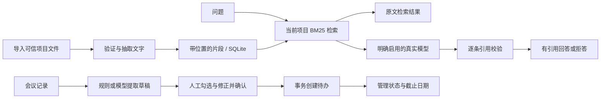

# 产品范围与决策记录

## 问题与用户

目标是帮助资料分散、会议行动容易遗漏的小型项目团队成员：查找结论时能核对原文，整理会议时能先检查再形成行动。当前交付为单人本机版本，用于实际体验与作品演示；尚无真实企业访谈、用户试用或线上数据支持。

用户已选择的核心要求：资料导入；有原文出处的问答；资料不足时拒答；会议中提取负责人和截止日期；必须人工确认再入待办库；约 30 题真实评测记录。验收目标是能运行、能核验、能讲清边界，而不是复刻完整 Dify 平台。

## 本轮实施选择

|选择|理由|代价与升级条件|
|---|---|---|
|独立目录，不改 WORK2|WORK2 聚焦合同流程，包含文件名样例回退；不能作为可信 RAG 能力|没有复用原系统的登录/角色模块；若未来接入须做独立权限设计|
|FastAPI 同源静态前端 + SQLite|Python 基础可读，单命令可启动，数据库事务足够当前单人场景|不适合直接开放为多人公网 SaaS|
|BM25 中文双字词检索|无需模型密钥和额外索引服务，易观察每次检索证据|同义表达召回有限；独立测试集证明短板后再考虑混合检索/重排|
|原文检索与真实模型分开|无密钥时仍能体验资料流程，避免假称模型已运行|基线仅衡量检索，不提供模型准确率|
|每条模型事实附引用并校验|能阻止不存在的引用片段直接展示|逐字出现不代表语义支持，保留人工核对提示|
|草稿与待办分表|模型建议不能直接变成行动承诺；支持刷新后确认|确认前的表单编辑只在页面内，最终以确认提交的值为准|
|归档/取消|保留历史引用与行动来源，避免误删|存储逐渐增长；需用户后续制定保留策略|
|固定 30 题与原始输出|让“效果好不好”有实际记录，而不是主观演示|题目同源且规模小，需要新增独立资料集与人工评分|

## 数据流程

## 验收口径

1. 新建两项目，A 资料不可从 B 的任何资料/问答/确认接口访问。
2. 导入受支持文件后可以查看文字与位置；损坏、无文字、超量和重复内容有明确错误。
3. 引用内容可追溯到原文；伪造 quote 或 source_id 的模型测试输出触发拒答。
4. 无模型配置选择真实模式返回 503 与配置提示，不静默降级或伪装成模型结果。
5. 提取完待办表仍为空；人工确认后写入；再次/并发确认只成功一次。
6. 负责人/日期未知时不编造，人工可以补充；刷新后已保存修改保留。
7. 30 题保留输入、输出、出处和耗时，并区分检索、测试替身与真实模型调用。
8. 浏览器走通问答/出处/草稿/确认/待办状态路径，覆盖错误、空白与加载状态。

## AI 协作与责任边界

本轮由 Codex 检查现有代码、提出实现范围、生成前后端、测试与文档，并实际执行自动化及浏览器验证。用户此前决定项目方向和关键验收要求。本轮未开展额外用户调研，也没有获得真实模型调用配置/费用授权，不能将尚未发生的验证写作完成。

用户后续亲自验收建议：换一份自编资料、故意提一个资料无法回答的问题、改一条会议负责人、指出并解释一个失败案例。只有实际做过且能复现的部分，才应在面试中作为自己的判断和验证经历。
